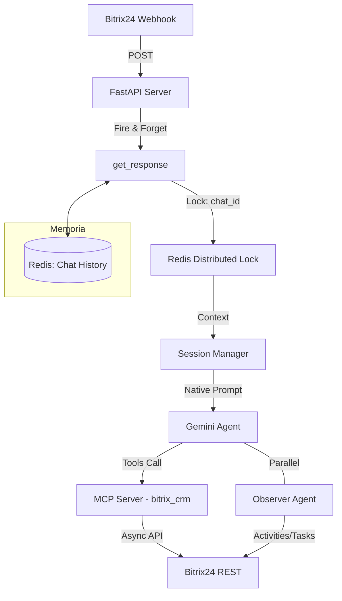

# 🤖 AI Agent Viajes y Viajes — Smart Bitrix24 Coordinator

Este es un asistente inteligente de nivel empresarial diseñado para la automatización de ventas y CRM de 'Viajes y Viajes'. Implementa una arquitectura asíncrona de alta concurrencia capaz de coordinar múltiples portales de Bitrix24 de forma simultánea y segura.

## 🌟 Características Principales

- **Arquitectura de Agentes Duales**: 
    - **Agente Principal**: Coordina la venta, agendamiento y calificación.
    - **Parallel Observer**: Un agente silencioso que analiza la calidad y registra actividades/tareas sin interrumpir el flujo.
- **Protocolo MCP (Model Context Protocol)**: Centralización de herramientas y recursos para una selección inteligente y eficiente por el LLM.
- **Concurrencia Distribuida**: Uso de Redis para Locks distribuidos y persistencia de historial, garantizando integridad de datos en entornos multi-instancia.
- **Implementación Asíncrona Global**: Refactorización completa con `httpx`, `aiofiles` y `redis-py` para cero bloqueos de I/O.

---

## 🛠️ Stack Tecnológico

| Componente | Tecnología |
| :--- | :--- |
| **LLM Engine** | Google Gemini (vía `GoogleAugmentedLLM`) / OpenAI |
| **Orquestador** | [mcp-agent](https://github.com/lastmile-ai/mcp-agent) |
| **Backend API** | FastAPI + Uvicorn (ASGI) |
| **Persistencia** | Redis (Memory Histoy + Distributed Locks) |
| **Infraestructura** | Docker + Docker Compose |
| **Protocolo CRM** | Servidor MCP local vía STDIO |

---

## 🏛️ Arquitectura del Sistema



---

## 📦 Componentes del Servidor MCP

El servidor local expone **45 herramientas**, **4 recursos** y **3 prompts** de orquestación.

### 🔧 Herramientas (Selección)

*   **Identidad y CRM**:
    *   `enrich_identity`: Cruza datos de chat con Bitrix para identificar Leads/Contactos.
    *   `qualify_lead`: Evalúa el potencial del prospecto basado en reglas de negocio.
    *   `lead_add` / `lead_update`: Gestión del ciclo de vida del prospecto.
*   **Ventas (Deals)**:
    *   `deal_move_stage`: Avanza deals en el embudo (Prospecto -> Cita -> Cierre).
    *   `deal_add_products`: Vincula productos del catálogo al deal.
*   **Agendamiento**:
    *   `calendar_availability_check`: Consulta tiempos libres evitando conflictos.
    *   `calendar_event_create`: Crea citas en el calendario de Bitrix con recordatorios.
*   **Documentación**:
    *   `document_generate`: Genera contratos o PDFs desde plantillas.
    *   `drive_file_upload`: Sube documentos generados al Drive de Bitrix.

### 📦 Recursos (Resources)
Acceso a datos estructurados para el agente:
- `bitrix://catalogs`: Estructura completa de productos.
- `bitrix://calendar/types`: Tipos de calendarios (Equipos, Personal, etc).
- `bitrix://documents/templates`: Catálogo de tipos de contrato disponibles.

### 💡 Prompts de Orquestación
Flujos de trabajo optimizados que el agente sigue:
1.  **`qualify_and_assign`**: Estrategia de descubrimiento y asignación de asesor.
2.  **`schedule_meeting`**: Protocolo de confirmación de citas (Virtual/Presencial).

---

## 📂 Guía de Configuración

### 🔑 Variables de Entorno (`.env`)
```env
# Bitrix24 API
BITRIX_DOMAIN=viajesyviajes.bitrix24.com
CLIENT_ID=app.xxx
CLIENT_SECRET=xxx
ACCESS_TOKEN=xxx
REFRESH_TOKEN=xxx

# LLM Provider
LLM_PROVIDER=google # o openai
GOOGLE_API_KEY=xxx
OPENAI_API_KEY=xxx

# Redis
REDIS_URL=redis://localhost:6379/0
```

### 🐳 Despliegue en Google Cloud Run
Para desplegar en Cloud Run con Redis embebido:
[Ver guía de despliegue en Cloud Run](./DEPLOY_CLOUDRUN.md)

---

## 🧩 Estructura de Módulos (`app/`)

- **`context.py`**: Inicialización centralizada de `MCPApp`.
- **`prompts.py`**: Contiene los `System Prompts` de los agentes (Rol, Tono, Reglas).
- **`sessions.py`**: Lógica de sesiones persistentes con `TTL` de 30 minutos y `locks` distribuidos.
- **`memory.py`**: Interfaz de Redis para gestión atómica del historial de mensajes.
- **`agent.py`**: Orquestador principal que coordina la entrada del usuario con el motor de IA.

---

## 🔒 Seguridad y Concurrencia
- **Aislamiento**: Cada `chat_id` tiene un `lock` único en Redis, evitando que dos procesos alteren la misma sesión.
- **Limpieza**: Sesiones inactivas se auto-limpian después de 30 min para liberar memoria.
- **Escalabilidad**: Al no depender de archivos locales (`.json`), el sistema puede escalar horizontalmente en múltiples servidores.
